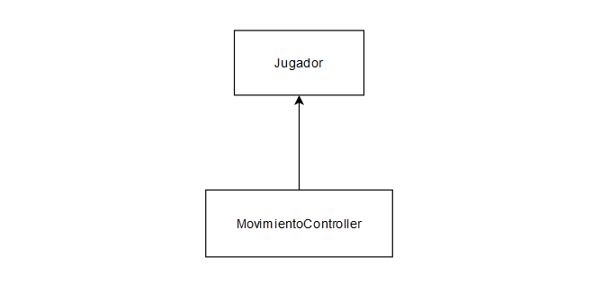
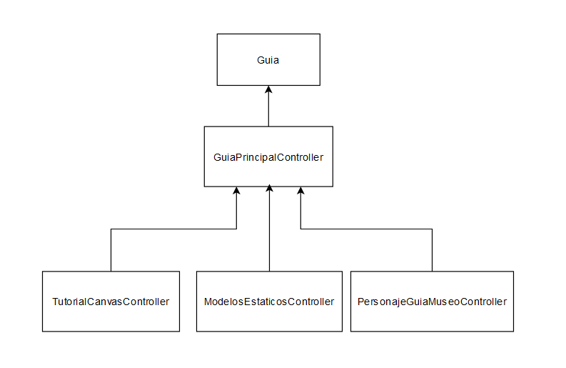

# Scripts-TFG-Museo_Vestimentas_RV
Pequeña descripcion del TFG y Demo de la aplicación

## Objetivo final
El objetivo final es ofrecer la experiencia de una visita al pasado en un museo de vestimentas usadas en el S.XVI en San Cristóbal de La Laguna en Realidad Virtual.
En esta aplicación se une el modelo digital del Museo Cayetano Gómez Felipe y modelos de personajes con vestimentas del s.XVI más comunes de La Laguna. 

## Scripts

En este proyecto se ha decidido añadir el sufijo Controller a cada clase implementada.  

En la imagen de encima se muestra como el jugador solo ha necesitado quese cree una clase encargada de su movimiento, debido a que el resto de funcionalidades son conseguidas a través de los assets de RV.  

Esta clase se encarga de recibir el input del controlador para que el jugador pueda moverse. También maneja la velocidad de movimiento y seencarga de que el jugador no sea capaz de atravesar paredes caminandoen la vida real, además cuando un jugador intenta atravesar una pared caminando en la vida real, esta clase se encarga de teletransportarlo al punto más cercano a esa pared para que no sea capaz de hacerlo.  

- TutorialCanvasController: Al comienzo de la aplicación hay una explicación escrita en paneles. Para que el jugador sea capaz de moverse entre estos, es necesario esta clase. La clase maneja elintercambio entre paneles.
- ModelosEstaticosController: Los modelos sin animación están divididos en grupos, para poder avanzar a través de estos, se usa esta clase.
- PersonajeGuiaMuseoController: El modelo que tiene animación se controla a través de esta clase. Esta maneja cuando debe avanzar, que animación debe reproducir y cuando mostrar su panel de información en cada parada.

Por último todas estas clases, son manejadas de manera externa através de la clase GuiaPrincipalController. Esta se encarga de coordinar las funciones del resto, permitiendo crear el servicio resultante de la guía.

## Video

